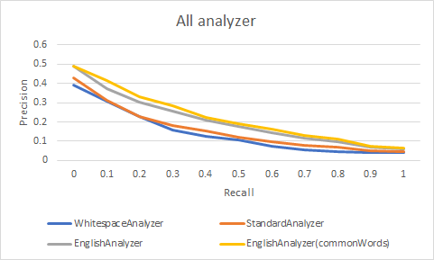

# Labo 2

> François Burgener, Tiago Povoa Q.

## Introduction

The goal of this lab is to compare different analyzers by calculating a set of the metrics introduced in the
course.

## What we need to do

We need to compare the four analyzers (`WhitespaceAnalyzer`, `StandardAnalyzer`, `EnglishAnalyzer` and `EnglishAnalyzer` with `commonWord`). for each evaluiation

### Evaluation

In this part we have to calculate the different metrics using queryResult and qrelResults
- Total of documents
- Total number retrieved documents for all queries
- Total number of relevant documents for all queries
- Total number of relevant documents retrieved for all queries.
- Average precision for all queries
- Average recall for all queries
- F-Measure using avg precision and avg recall 
- Mean avarage precision for all queries
- Avarage R-Precision for all queries

### Analyse
The differents mertrics result for each analyzer are in ``metrics.txt``

#### All graph of Average precision at recall levels

We can see that the accuracy of the english analyzer at each recall point is higher than the other analyzer. More for the english analyzer that uses common words. We can see that their curves fall less quickly than the other two analyzer (`` whitespaceanalyzer`` and `` standardanalyzer``).In addition, we see that their curve goes down less quickly.This is due to the fact that the english analyzer have less retrieved document and therefore have a better chance of having a better result (on the same collection than the others).

#### Conclusion

We can conclude that the english anaylzer are more efficient than the standard and the whitespace analyzer for the collection made available for this labo.

